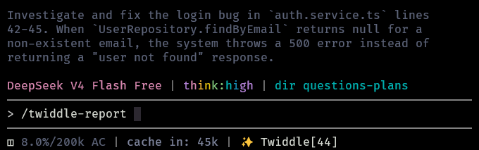

<picture>
  <source media="(prefers-color-scheme: dark)" srcset="https://img.shields.io/badge/pi--twiddle-v2.1-2a2a2a?style=flat&labelColor=111&color=555">
  
</picture>

# Twiddle

> Prompt distillation for [pi](https://pi.ai). Twiddle cleans, sharpens, and structures prompts before they reach the agent.

**Not free:** every optimization costs tokens. Tiny prompts can lose more than they save. Watch the footer counter (`✨ Twiddle [12k]` / `~ Twiddle [12k]`) to track net savings.

## What it does

- Translates any language into clear engineering English
- Classifies intent with fast regex rules
- Injects project context when useful
- Preserves code blocks, inline code, URLs, hashes, and semver
- Falls back through a model chain on timeout
- Skips optimization if output would exceed token budget

## Quick Start

```sh
/twiddle-model
/twiddle-auto-on

~explique o padrão Repository em NestJS com exemplos
```

If no optimization model is configured yet, Twiddle offers the available models once per session. Selecting a model saves it and continues optimization; canceling sends prompts unchanged for the rest of the session.

Default token budget threshold is 40%.

## Activation

| Input | Behavior |
|---|---|
| `~text` | Optimize and forward |
| `~.text` | Bypass, send original |
| `~!text` | Optimize silently |
| `~raw:text` | Bypass, alias for `~.` |
| `~bug:text` | Force `bug_fix` |
| `~feature:text` | Force `new_feature` |
| `~refactor:text` | Force `refactor` |
| `~research:text` | Force `research` |
| `~test:text` | Force `testing` |
| `~review:text` | Force `review` |
| `~docs:text` | Force `docs` |
| `~infra:text` | Force `infrastructure` |
| `~design:text` | Force `design` |

**Auto-mode** (`/twiddle-auto-on`): every prompt gets distilled, unless it is a trivial greeting.

## Commands

| Command | Purpose |
|---|---|
| `/twiddle` | Show current config |
| `/twiddle-model` | Select optimization model |
| `/twiddle-threshold` [0–500] | Set token budget margin |
| `/twiddle-timeout` [5–60] | Set per-model timeout in seconds |
| `/twiddle-fallback` add\|remove\|list\|clear | Manage fallback chain |
| `/twiddle-verbose` quiet\|normal\|debug | Set notification verbosity |
| `/twiddle-auto-on` | Enable auto-mode |
| `/twiddle-auto-off` | Disable auto-mode |
| `/twiddle-report` | Show session stats |
| `/twiddle-setup` | Interactive setup |
| `/twiddle-reset` | Restore defaults |

## Screenshots

### Settings


### Prompt report



## How it works

1. Detect `~` input and parse override prefixes
2. Classify intent and scope
3. Inject project context when available
4. Optimize via a separate `pi` subprocess
5. Restore preserved fragments
6. Keep original prompt if optimization misses budget or fails

## Project layout

```text
pi-twiddle/
├── index.ts
├── optimizer.ts
├── intent.ts
├── project.ts
├── preserve.ts
├── tokenizer.ts
├── config.ts
├── README.md
├── package.json
├── tsconfig.json
├── assets/
└── *.test.ts
```

## Design

- Quiet by default
- No API key management
- Graceful fallback on failure
- Footer shows mode + savings at a glance

_Theme: [Harpy](https://pi.dev/packages/harpy-theme)_
