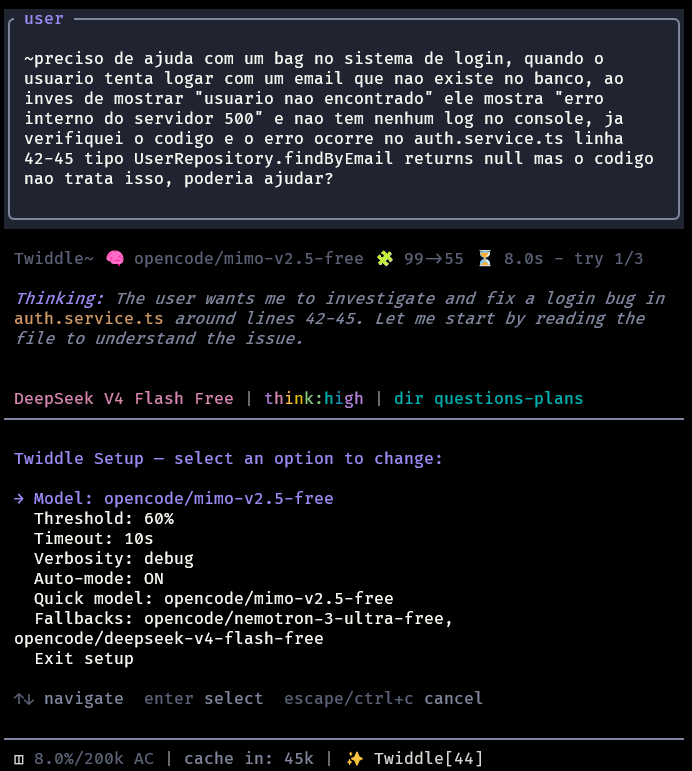
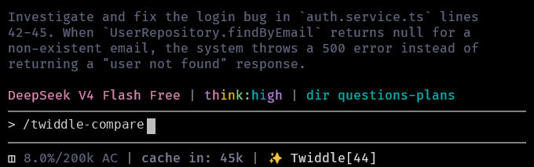

<picture>
  <source media="(prefers-color-scheme: dark)" srcset="https://img.shields.io/badge/pi--twiddle-v2.1-2a2a2a?style=flat&labelColor=111&color=555">
  
</picture>

# Twiddle

> Prompt distillation for [pi](https://pi.ai). Twiddle cleans, sharpens, and structures prompts before they reach the agent.

**Not free:** every optimization costs tokens. Tiny prompts can cost more than they improve. The footer shows the active mode: `~ Twiddle` for manual mode and `≈ Twiddle` for auto-mode.

## What it does

- Translates any language into clear engineering English
- Classifies intent with fast regex rules
- Injects project context when useful
- Preserves code blocks, inline code, URLs, hashes, and semver
- Refuses outputs that drop, duplicate, or invent protected fragments
- Falls back through a model chain on failure (never on explicit cancel)
- Skips optimization if output would exceed the expansion limit
- Stores each applied transformation as a session entry (original vs applied) without polluting model context

## Quick Start

```sh
/twiddle
/twiddle-auto-toggle

~explique o padrão Repository em NestJS com exemplos
```

If no optimization model is configured yet, Twiddle offers the available models once per session. Selecting a model saves it and continues optimization; canceling sends prompts unchanged for the rest of the session.

Default expansion limit is 40%: optimized text longer than input + 40% is discarded and the original is sent.

## Activation

| Input | Behavior |
|---|---|
| `~text` | Optimize and forward |
| `~.text` | Bypass, send original |
| `~!text` | Optimize silently |
| `~raw:text` | Bypass, alias for `~.` |
| `~bug:text` | Force `bug_fix` |
| `~feature:text` | Force `new_feature` |
| `~refactor:text` | Force `refactor` |
| `~research:text` | Force `research` |
| `~test:text` | Force `testing` |
| `~review:text` | Force `review` |
| `~docs:text` | Force `docs` |
| `~infra:text` | Force `infrastructure` |
| `~design:text` | Force `design` |

**Auto-mode** (`/twiddle-auto-toggle`): every prompt gets distilled. The default minimum is 1 character, but numeric-only prompts are skipped. Configure minimum length, expansion limit, timeout, fallbacks, and verbosity under `/twiddle`. `~` always optimizes, regardless of length.

## Footer

| Indicator | Mode |
|---|---|
| `~ Twiddle` | Manual mode — use `~` to optimize a prompt |
| `≈ Twiddle` | Auto-mode — eligible prompts are optimized automatically |

While optimization is running, Twiddle uses a subtle shimmer over the name. The footer does not show token savings because Twiddle is focused on clarity, translation, structure, and deduplication rather than savings accounting.

## Commands

| Command | Purpose |
|---|---|
| `/twiddle` | Open the control panel (model, fallbacks, limits, verbosity, auto-mode) |
| `/twiddle-compare` | Show debug data, original text, and processed text from the latest optimization |
| `/twiddle-auto-toggle` | Toggle auto-mode |
| `/twiddle-reset` | Restore defaults (clears model and fallbacks) |

## Screenshots

### Settings



### Prompt comparison



## How it works

1. Detect `~` input and parse override prefixes
2. Classify intent and scope
3. Inject project context when available
4. Optimize via separate `pi` subprocess; oversized prompts use temporary `@file` transport and are removed after execution
5. Verify every protected placeholder survived exactly once, then restore fragments
6. Keep original prompt if optimization is cancelled, misses expansion limit, or fails
7. Record comparison (original vs applied) as session entry; restore only active branch and reapply every transformed user message consistently across model calls

## Privacy

Each applied optimization stores original and optimized text in session file as collapsed `twiddle-comparison` entry (outside model context). Resume, branch, export (`/export`), and share (`/share`) include these records. Config is validated before use and written atomically. Avoid pasting secrets you would not keep in history.

## Project layout

```text
pi-twiddle/
├── index.ts
├── optimizer.ts
├── intent.ts
├── picker.ts
├── project.ts
├── preserve.ts
├── tokenizer.ts
├── footer.ts
├── missing-model-warning.ts
├── history.ts
├── config.ts
├── README.md
├── package.json
├── tsconfig.json
├── assets/
└── *.test.ts
```

## Design

- Quiet by default
- No API key management
- Graceful fallback on failure
- Footer shows active mode without token-savings counters

_Theme: [Harpy](https://pi.dev/packages/harpy-theme)_
